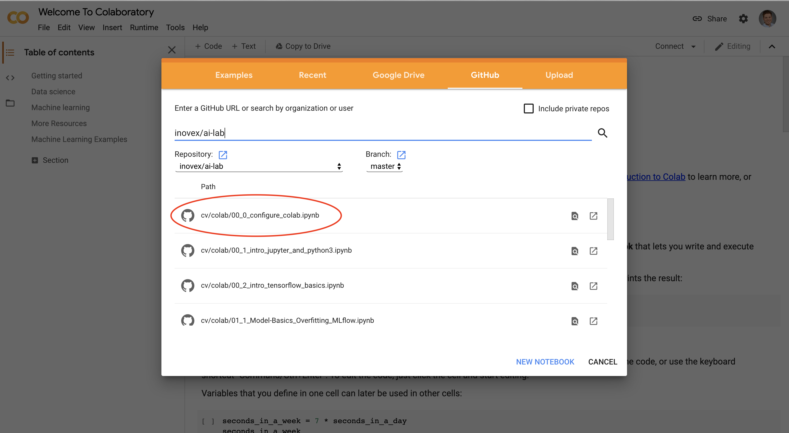

# AI-Lab HSKA: COVID-19 Edition

As we do not have access to the computer lab, we provide Google colab notebooks with the exercises. 

Google colab is a hosted notebook service with free access to GPU and even TPU runtimes for collaborative use in data science and machine learning applications. It is based on Jupyter notebooks, so if you are familiar with Jupyter, you should get easily up and running with colab. 

## Setup

Follow these steps to get your colab environment up and running.

1. Go to https://colab.research.google.com/ and import the config notebook by navigating to the GitHub tab and searching for *inovex/ai-lab*. Select the *00_0_configure_colab.ipynb*.

2. Mount your Google Drive as folder to your colab contents. This will be used to save the repository and your work in your Google Drive. If Colab displays a warning like "This notebook was not authored by Google", click "Run anyway". Follow the URL that is printed and follow the instructions.
3. Clone the GitHub repostory to your Google Drive. You can later use this notebook to pull changes from the remote as the lab progresses.

## Useful tips

1. Currently, colab cant open Notebooks from your Drive. To open the exercises, you have to open your Drive in a seperate browser window and open the notebook with colab. 
2. Check your runtime! If you work on less compute intensive tasks, make sure to switch to an non-accelerated runtime. Colab is free, but they have some resource limitations. GPUs and TPUs are sometimes prioritized for users who use Colab interactively rather than for long-running computations, or for users who have recently used less resources in Colab.
3. For other useful tips, we recommend watching this video of the 2020 TensorFlow DevSummit, which is also included in the slides of the kick-off event: https://youtu.be/pnClcwTCyc0
